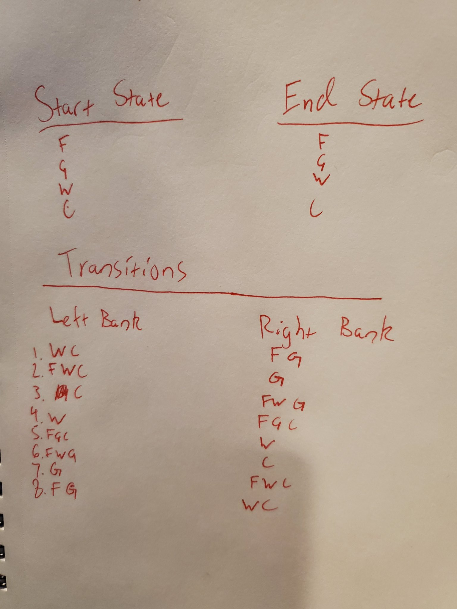

# P1: Search & Constraint Satisfaction
Collaborator(s): Edgar Dixon

This project, as most projects in this class, requires writing a lot of code. You are free to introduce any helper methods you would like. I also encourage you to write test cases for each method you write, as that will significantly cut down on debugging time.

Starting with question 16, you will need to install the [simanneal](https://github.com/perrygeo/simanneal) python library. Installation instructions can be found in the project's documentation. Let me know ASAP if you cannot get the installation to work.

1.	Draw out the complete state space, including transitions, for the following river-crossing problem (https://en.wikipedia.org/wiki/Wolf,_goat_and_cabbage_problem). Use a riverbank focused representation.

    _Once upon a time a farmer went to a market and purchased a wolf, a goat, and a cabbage. On his way home, the farmer came to the bank of a river and rented a boat. But crossing the river by boat, the farmer could carry only himself and a single one of his purchases: the wolf, the goat, or the cabbage._

    _If left unattended together, the wolf would eat the goat, or the goat would eat the cabbage._

    _The farmer's challenge was to carry himself and his purchases to the far bank of the river, leaving each purchase intact. How did he do it?_
    

2.	A river crossing problem is defined in RiverCrossing.py. Make sure you understand both the RiverCrossingProblem and RiverCrossingState classes.       
a.	How is the start state represented in `RiverCrossingProblem`? What about the goal state? (Don’t overthink these)  
    Everyone on left bank is start, everyone on right is goal state
b.	What are the available actions for a `RiverCrossingState`?  
    It can move right, left, check if it's valid, and check if it can move
c.	What parts of a state-space problem (as defined in the P&M textbook) are missing?  

3.	In main.py, start filling in the function main(), which we will use to test our solutions. Start by defining a RiverCrossingProblem to match the description in question 1, above. Assume that the farmer starts on the left riverbank. _Note: We use a two-bank representation to make it easier to visualize the problem._ 

4.	Go back to RiverCrossing.py.  Fill in the `is_valid_state` method in `RiverCrossingState`. The method should return True if a given state is valid per the Wolf, Goat, Cabbage river-crossing problem defined above (i.e., all items on each bank can be left unattended together) and False otherwise. _Hint: how does the farmer’s presence affect what can be on each bank?_

5.	Go back to RiverCrossing.py. Fill in the `next_state` method in `RiverCrossingProblem`. This is an action function—given a state and an item, it returns a new state where the item has been moved to the other river bank. If the item cannot be moved (i.e., because it is not on the same side as the farmer), it raises a `ValueError`. You may assume that only one copy of each item exists (i.e., if there is a goat on the left bank, there is not also a goat on the right bank). _Hint: Don't forget to update the new state's path._

6.	To finish out our definition of the river crossing problem, fill in the `populate_frontier` method in `RiverCrossingProblem`, which puts all possible successor states from the current state onto the RiverCrossingProblem’s frontier.

7.	An outline of Breadth First Search is given to you in BFS.py. Fill in the `breadth_first_search` method so that it solves the river crossing problem defined in RiverCrossing.py. Test your BFS implementation on the RiverCrossingProblem you’ve defined in main.py. 

8.	An outline of Depth First Search is given to you in DFS.py. Fill in the the `breadth_first_search` method so that it solves the river crossing problem defined in RiverCrossing.py. Think carefully about how DFS differs from BFS. Test your DFS implementation on the RiverCrossingProblem you’ve defined in main.py (make a deep copy of the problem definition first). 

9.	Draw out the assignment space for a generate-and-test approach to the N-Queens puzzle with 3 queens on a 3x3 board (https://en.wikipedia.org/wiki/Eight_queens_puzzle). _Note that the assignment space for N-Queens is approximately N^N, so you will draw 27 states. 4-Queens, the first problem with a valid solution has an assignment space of 256_

    _To solve an N-Queens puzzle for some n, n chess queens must be placed on an n x n chess board, such that no queen is attacking another. Note that queens attack on the horizontal, vertical, and diagonal._

10.	An N-Queens problem is defined in NQueens.py. Make sure you understand both the NQueensProblem and NQueensState classes.    
a.	How is the start state represented in `NQueensProblem`? Why is a goal state _not_ represented? 
    Start state is the whole board empty. There is no goal state because there isn't 1 perfect goal state
b.	What are the available actions for a `NQueensState`?  
    Checking if it's valid and placing a queen
c.	What parts of a state-space problem (as defined in P&M textbook) are missing?  

11.	Define an NQueensProblem in main.py for n=4.

12.	Go back to NQueens.py. In NQueensState, fill in the `is_valid_state` method, which returns `True` if no queens are attacking each other on a state's board. Recall that queens attack on the horizontal, vertical, _and_ diagonal. _Hint: if two queens are on the same diagonal, either the sum of their row and column is the same, or the difference between their and column is the same. I encourage you to work this out on paper so you believe me._

13.	The `next_state` method for NQueensProblem is filled in for you. Make sure you understand what it’s doing, then fill in the `populate_frontier` method, which puts all possible successor states from the current state onto the NQueensProblem’s frontier. Since `next_state` expects a row and a column to be passed in, `populate_frontier` should find all possible locations on the board where a queen can be placed. It should _not_ check whether that location is valid.

14.	In main.py, use DFS to solve the NQueensProblem you defined for n=4.

15.	Next, we are going to try Simulated Annealing on NQueens. What should a starting state look like for Simulated Annealing? Define such a start state in main.py for n=4. Make sure to place the appropriate number of queens, but not to solve the puzzle yourself.
    4 queens placed but not perfectly

16.	We are going to use a python library,[simanneal](https://github.com/perrygeo/simanneal), to solve our NQueensProblem using Simulated Annealing. Read the library's documentation. What two methods does [simanneal](https://github.com/perrygeo/simanneal) require a problem to have? What should each of these methods do?
    It requires a move method which randomly moves or alters the state and an enrgy function that compares current energy to previous energy and then accepts or rejects the current state based on temperature. 

17.	We will define the temperature of an NQueensProblem as the number of conflicts in its current state. Fill in the `energy` method in NQueensProblem to return the temperature. _Hint: refer to your `is_valid_state` method. This will look very similar, but with a few tweaks._

18.	We will define a successor of a state as any state where exactly one queen is moved to another location. Note that this is different from how the `next_state` method is implemented. Fill in the `move` method in NQueensProblem to pick a random queen off the current state’s board, and place it in a new location. _Hint: Several methods are imported into NQueens.py from the random library. These are sufficient to solve this problem, although you may import others if you think they’ll be helpful._

19.	Call the `anneal` method from the [simanneal](https://github.com/perrygeo/simanneal) library on the NQueensProblem you defined in question 14 (follow their example for the Traveling Salesman Problem). 

20.	Run simulated annealing on your NQueensProblem a few more times (you can either define deep copies of your NQueensProblem from #14, or just run your main method several times). Does the answer change? If so, what accounts for the change?

21. You may have noticed that simulated annealing doesn't always find a valid solution. Google some of the applications of simulated annealing in the real world. Why might finding such local minima (as opposed to finding a global minimum/solution) be acceptable in those applications?
